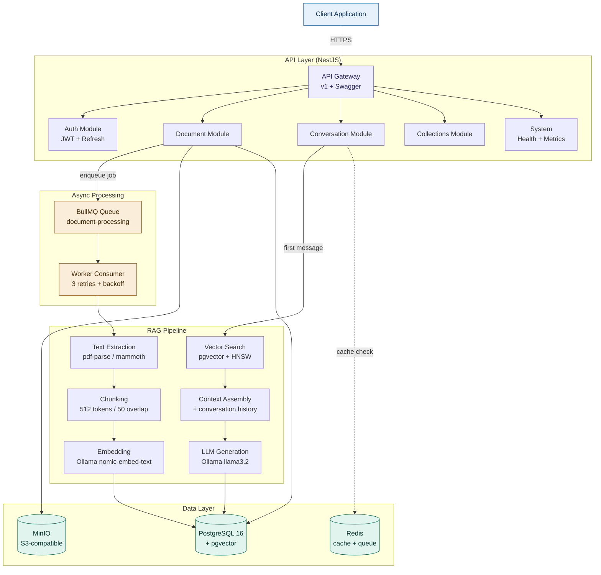

# DocuMind AI

> An intelligent document Q&A platform that lets you upload documents (PDF, DOCX, TXT), automatically indexes them with vector embeddings, and answers natural-language questions with cited sources — grounded entirely in your own content.

[](https://nestjs.com/)
[](https://www.typescriptlang.org/)
[](https://www.postgresql.org/)
[](https://github.com/pgvector/pgvector)
[](https://docs.docker.com/compose/)
[](LICENSE)

---

## Table of Contents

- [DocuMind AI](#documind-ai)
  - [Table of Contents](#table-of-contents)
  - [What it does](#what-it-does)
  - [Architecture](#architecture)
    - [Click here for more in-depth information on Documind AI architectural design.](#click-here-for-more-in-depth-information-on-documind-ai-architectural-design)
  - [Tech stack](#tech-stack)
  - [Key features](#key-features)
    - [Document ingestion](#document-ingestion)
    - [RAG pipeline](#rag-pipeline)
    - [Conversation intelligence](#conversation-intelligence)
    - [Production hardening](#production-hardening)
  - [Quick start](#quick-start)
    - [Prerequisites](#prerequisites)
    - [Setup](#setup)
    - [First request](#first-request)
  - [Environment variables](#environment-variables)
  - [API documentation](#api-documentation)
  - [Design decisions](#design-decisions)
    - [Why pgvector over Pinecone/Weaviate?](#why-pgvector-over-pineconeweaviate)
    - [Why BullMQ over Kafka?](#why-bullmq-over-kafka)
    - [Why Ollama for both embeddings and LLM?](#why-ollama-for-both-embeddings-and-llm)
    - [Why a single BullMQ job (not split per step)?](#why-a-single-bullmq-job-not-split-per-step)
    - [Why version-based cache invalidation?](#why-version-based-cache-invalidation)
    - [Why soft-delete for conversations?](#why-soft-delete-for-conversations)
    - [Why raw SQL for vector operations?](#why-raw-sql-for-vector-operations)
    - [Why CPU inference (llama3.2 3B)?](#why-cpu-inference-llama32-3b)
  - [Project structure](#project-structure)
  - [Performance characteristics](#performance-characteristics)
  - [Limitations](#limitations)
  - [Production considerations](#production-considerations)
  - [Roadmap](#roadmap)
  - [License](#license)
  - [Acknowledgments](#acknowledgments)

---

## What it does

Knowledge workers waste 20-30% of their time searching through documents. Keyword search misses semantic meaning, and generic AI chatbots can't access private documents. DocuMind solves this with **Retrieval-Augmented Generation (RAG)** — every answer is grounded in your uploaded documents with verifiable citations, including the source document name, page number, and similarity score.

**Use cases:**

- Legal teams reviewing contracts for specific clauses
- Researchers querying across multiple academic papers
- Compliance officers verifying regulations across policy documents
- Anyone who needs a private, self-hosted alternative to generic AI chatbots

---

## Architecture



**Flow at a glance:**

1. **Upload** → file lands in MinIO, BullMQ job is enqueued
2. **Processing** → worker extracts text, chunks it, generates embeddings, stores in pgvector
3. **Question** → query embedded, vector similarity search finds top-K chunks
4. **Answer** → context assembled with history, LLM generates cited response
5. **Cache** → identical questions on the same collection return instantly from Redis

### Click here for more in-depth information on [Documind AI](/src/docs/ARCHITECTURE.md) architectural design.
---

## Tech stack

| Layer              | Technology                                      | Why                                          |
|--------------------|--------------------------------------------------|----------------------------------------------|
| **Framework**      | NestJS 11 + TypeScript 5                        | Modular DI, strong typing, mature ecosystem  |
| **Database**       | PostgreSQL 16 + pgvector 0.7                    | Single store for relational + vector data    |
| **ORM**            | Prisma (+ raw SQL for vector ops)               | Type-safe queries, migrations               |
| **Queue**          | BullMQ + Redis                                  | Reliable retries, exponential backoff       |
| **Object Storage** | MinIO (S3-compatible)                           | Local-friendly, production-portable          |
| **Embeddings**     | Ollama `nomic-embed-text` (768d)                | Open-source, swappable for production       |
| **LLM**            | Ollama `llama3.2` (3B)                          | CPU-friendly, abstracted behind interface   |
| **Auth**           | JWT (access + refresh) via Passport             | Industry-standard, stateless                |
| **Validation**     | class-validator + class-transformer             | DTO-driven request validation               |
| **API Docs**       | Swagger/OpenAPI                                 | Interactive docs at `/api/docs`              |
| **Health**         | @nestjs/terminus v11                            | Liveness probes for all dependencies        |
| **Rate Limiting**  | @nestjs/throttler + Redis store                 | Distributed, multi-instance ready           |

---

## Key features

### Document ingestion
- Multi-format support: PDF, DOCX, TXT
- 20MB file size limit, 50 documents per user
- SHA-256 checksum-based duplicate detection per collection
- Async processing with BullMQ (3 retries, exponential backoff)
- Automatic cleanup on final failure so users can re-upload

### RAG pipeline
- Recursive text chunking (512 tokens, 50-token overlap)
- 768-dimensional vector embeddings via Ollama
- HNSW index on pgvector for sub-second similarity search
- Top-5 chunk retrieval with 0.3 cosine similarity threshold
- Citation tracking: every answer includes source document, page number, and similarity score

### Conversation intelligence
- Collection-scoped Q&A (organize documents by project)
- Conversation history injection (last 10 messages) for follow-up questions
- Soft-delete for conversation recovery
- Redis caching with version-based invalidation

### Production hardening
- Global exception filter with Prisma error mapping
- Rate limiting with 3-tier system (strict/moderate/default)
- Input sanitization interceptor (XSS, null byte stripping)
- Prompt injection guard (12 attack patterns)
- Helmet for security headers
- Gzip compression
- CORS configured per environment
- Correlation IDs (`X-Request-ID`) on every request
- Health checks for all dependencies
- Operational metrics endpoint

---

## Quick start

### Prerequisites

- Docker + Docker Compose
- Node.js 20+
- pnpm 9+
- 8GB RAM minimum (Ollama is memory-hungry)

### Setup

```bash
# 1. Clone the repo
git clone https://github.com/<your-username>/documind-ai.git
cd documind-ai

# 2. Install dependencies
pnpm install

# 3. Configure environment
cp .env.example .env
# Edit .env with your secrets (see Environment variables section)

# 4. Start infrastructure (Postgres, Redis, MinIO, Ollama)
docker-compose up -d

# 5. Pull Ollama models (one-time, ~3GB download)
docker exec -it ollama ollama pull nomic-embed-text
docker exec -it ollama ollama pull llama3.2

# 6. Run database migrations
pnpm prisma migrate deploy
pnpm prisma generate

# 7. Start the application
pnpm start:dev
```

The API runs on `http://localhost:3000`. Swagger documentation is at `http://localhost:3000/api/docs`.

### First request

```bash
# Register a user
curl -X POST http://localhost:3000/api/v1/auth/register \
  -H "Content-Type: application/json" \
  -d '{"email": "you@example.com", "password": "StrongP@ss1", "name": "You"}'

# Login (returns access + refresh tokens)
curl -X POST http://localhost:3000/api/v1/auth/login \
  -H "Content-Type: application/json" \
  -d '{"email": "you@example.com", "password": "StrongP@ss1"}'

# Upload a document
curl -X POST http://localhost:3000/api/v1/document/upload \
  -H "Authorization: Bearer <ACCESS_TOKEN>" \
  -F "file=@./your-document.pdf"

# Ask a question (replace :collectionId with your General collection ID)
curl -X POST http://localhost:3000/api/v1/conversation/:collectionId \
  -H "Authorization: Bearer <ACCESS_TOKEN>" \
  -H "Content-Type: application/json" \
  -d '{"content": "What are the key findings?"}'
```

---

## Environment variables

| Variable                  | Description                                  | Default                  |
|---------------------------|----------------------------------------------|--------------------------|
| `DATABASE_URL`            | PostgreSQL connection string                | —                        |
| `JWT_ACCESS_SECRET`       | Access token signing secret                 | —                        |
| `JWT_REFRESH_SECRET`      | Refresh token signing secret                | —                        |
| `JWT_ACCESS_EXPIRY`       | Access token TTL                            | `15m`                    |
| `JWT_REFRESH_EXPIRY`      | Refresh token TTL                           | `7d`                     |
| `REDIS_HOST`              | Redis host                                  | `localhost`              |
| `REDIS_PORT`              | Redis port                                  | `6379`                   |
| `MINIO_ENDPOINT`          | MinIO host                                  | `localhost`              |
| `MINIO_PORT`              | MinIO API port                              | `9000`                   |
| `MINIO_ROOT_USER`         | MinIO access key                            | —                        |
| `MINIO_ROOT_PASSWORD`     | MinIO secret key                            | —                        |
| `MINIO_BUCKET_NAME`       | Bucket for document storage                 | `documents`              |
| `OLLAMA_URL`              | Ollama server URL                           | `http://localhost:11434` |
| `THROTTLE_TTL`            | Rate limit window (ms)                      | `60000`                  |
| `DEFAULT_THROTTLE_LIMIT`  | Default tier req/min                        | `100`                    |
| `STRICT_THROTTLE_LIMIT`   | Auth endpoints req/min                      | `5`                      |
| `MODERATE_THROTTLE_LIMIT` | Upload/conversation req/min                 | `10`                     |
| `QUERY_CACHE_TTL`         | Query cache TTL (seconds)                   | `3600`                   |
| `QUERY_CACHE_ENABLED`     | Kill switch for query cache                 | `true`                   |
| `CORS_ORIGIN`             | Allowed origins (comma-separated or `*`)    | `*`                      |
| `PORT`                    | HTTP port                                   | `3000`                   |

A complete `.env.example` is included in the repo.

---

## API documentation

Interactive Swagger UI is available at `http://localhost:3000/api/docs` when running locally.

**Endpoint groups:**

- **Auth** — Register, login, refresh, logout
- **Users** — Profile management
- **Documents** — Upload, list, download URL, delete
- **Conversations** — Create, send message, list, get, delete
- **Collections** — CRUD for document collections
- **System** — Health checks, metrics, queue status

All non-public routes require a `Bearer <access_token>` header. Click **Authorize** in Swagger to test authenticated endpoints from the browser.

---

## Design decisions

### Why pgvector over Pinecone/Weaviate?

I already use PostgreSQL for relational data. Adding pgvector means one database instead of two, one connection pool, one backup strategy, and one mental model. The performance gap closes meaningfully once you add an HNSW index. For sub-10M chunks, pgvector is the right call.

### Why BullMQ over Kafka?

Kafka is a distributed log designed for cross-service event streaming. This pipeline is a single-application job queue: upload → process → done. BullMQ gives me reliable retries, exponential backoff, and DLQ semantics with the Redis I already run. Kafka would add ZooKeeper/KRaft operational complexity for zero benefit at this scale.

### Why Ollama for both embeddings and LLM?

Local inference means zero API costs during development and complete privacy for sensitive documents. The `EmbeddingService` and `LlmService` are abstracted behind interfaces — swap to OpenAI, Anthropic, or Gemini in production with one line of DI change. `google-embedding.service.ts` and `openai-embedding.service.ts` are committed to the repo as reference implementations.

### Why a single BullMQ job (not split per step)?

Steps (download → extract → chunk → embed → store) are tightly coupled and sequential. Splitting into separate jobs adds inter-job coordination state, error handling complexity, and partial-failure recovery logic without any throughput benefit. The pipeline is structured as separate service methods inside one job, so it's trivial to split later if I need to.

### Why version-based cache invalidation?

The naive approach — invalidate cache entries when a document changes — requires expensive `SCAN` operations to find matching keys. Instead, I store a `doc_version` counter per collection in Redis. Cache keys include the version: `qa_cache:{collectionId}:v{version}:{questionHash}`. When a document is added/deleted, I increment the counter. Old cache entries become unreachable and expire naturally via TTL. O(1) reads, O(1) invalidation, no key scans.

### Why soft-delete for conversations?

Users sometimes delete conversations and immediately regret it. Soft-delete (`isActive: false`) allows recovery and analytics. A cron job (planned) will hard-delete inactive conversations after 7 days.

### Why raw SQL for vector operations?

Prisma's `Unsupported` type can't be written through the normal ORM API. Vector inserts, similarity queries, and HNSW index creation all use `$queryRawUnsafe` / `$executeRaw`. The trade-off is no compile-time type safety on vector columns, but it's the only path until Prisma adds native pgvector support.

### Why CPU inference (llama3.2 3B)?

For a portfolio project, I wanted the entire stack runnable on a developer laptop without GPU access. Expect 100-200s per query. In production, swap to Gemini Flash or GPT-4o-mini via the abstracted `LlmService` — same interface, sub-3-second responses.

---

## Project structure

```
documind-ai/
├── prisma/
│   ├── migrations/                  # All Prisma migrations
│   └── schema.prisma                # Database schema
├── src/
│   ├── auth/                        # JWT auth, guards, strategies, @Public decorator
│   ├── users/                       # User CRUD
│   ├── collections/                 # Collection CRUD
│   ├── document/                    # Upload, processing, listing
│   │   ├── consumers/               # BullMQ worker
│   │   ├── services/                # Text extraction, chunking, embedding
│   │   └── dto/
│   ├── conversation/                # RAG Q&A
│   │   ├── services/                # Vector search, context assembly, LLM
│   │   └── dto/
│   ├── query-cache/                 # Redis caching layer
│   ├── health/                      # Terminus health indicators
│   ├── metrics/                     # Operational metrics
│   ├── queue/                       # BullMQ module
│   ├── minio/                       # Object storage
│   ├── prisma/                      # Prisma service
│   ├── common/
│   │   ├── filters/                 # Global exception filter
│   │   ├── interceptors/            # Sanitization, correlation ID
│   │   ├── guards/                  # Prompt injection guard, custom throttler
│   │   └── constants/
│   ├── app.module.ts
│   └── main.ts                      # Bootstrap (Swagger, CORS, helmet, versioning)
├── docker-compose.yml
├── .env.example
└── package.json
```

---

## Performance characteristics

Measured on a developer laptop (16GB RAM, no GPU):

| Operation                          | Latency       | Notes                                   |
|------------------------------------|---------------|-----------------------------------------|
| Document upload (PDF, 5MB)         | <500ms        | File-to-MinIO + job enqueue             |
| Document processing (full pipeline)| 100-200s        | For a typical 50-page document          |
| Vector search (top-5)              | <100ms        | With HNSW index                         |
| First-message query (cache miss)   | 100-200s      | CPU-bound LLM inference                 |
| Cached query (cache hit)           | <50ms         | Redis lookup + DB write                 |
| Health check                       | <50ms         | All four dependency probes              |

In production with Gemini Flash or GPT-4o-mini instead of CPU llama3.2, expect first-message queries at 2-5 seconds.

---
## Limitations
- It's important to note that the performance characteristics listed above are metrics gotten from using the ollama 3.2 free tier model. Hence why the latency on a document processing (full pipeline) is quite high. This means a paid tier or another model (such as google's gemini flash) will result in a faster document processing pipeline experience (lower latency).
- There are pre-existing integration setup for other models in this application, if you need to switch. Check out the service injections for these models [here](/src/document/services/).
  
---
## Production considerations

This project is built as a portfolio demonstration. Deploying to production would require:

- **Swap to managed LLM** — replace Ollama with Gemini Flash or OpenAI for sub-3s responses. The `LlmService` interface makes this a one-file change.
- **Network-level metrics restriction** — bind `/health` and `/metrics` to an internal port (e.g., `:9090`) only reachable from inside the VPC. Prometheus scrapes from inside the network.
- **Managed Postgres + Redis** — Supabase, Neon, or RDS for Postgres; Upstash or ElastiCache for Redis.
- **S3 instead of MinIO** — same interface, just change the endpoint config.
- **Secrets management** — move `.env` values to AWS Secrets Manager or similar.
- **Observability stack** — wire `/metrics` to Prometheus, dashboards in Grafana, traces via OpenTelemetry.
- **CDN + WAF** — Cloudflare or CloudFront in front of the API.
- **Multi-instance deployment** — the app is stateless (all state in Postgres/Redis/MinIO), so it scales horizontally with no additional work.

---

## Roadmap

Planned enhancements:

- [ ] OCR pipeline for scanned PDFs (Tesseract integration)
- [ ] Multi-language support (currently English-only)
- [ ] Streaming LLM responses via Server-Sent Events
- [ ] Document sharing across users (currently single-tenant per user)
- [ ] Background job for soft-deleted conversation cleanup
- [ ] Fine-grained per-document access control
- [ ] Webhook notifications when processing completes

---

## License

MIT

---

## Acknowledgments

Built by [Oluwafemi Idowu](https://github.com/femi-id) as part of a portfolio project demonstrating production-grade backend engineering: event-driven architecture, RAG pipelines, observability, and operational discipline.
