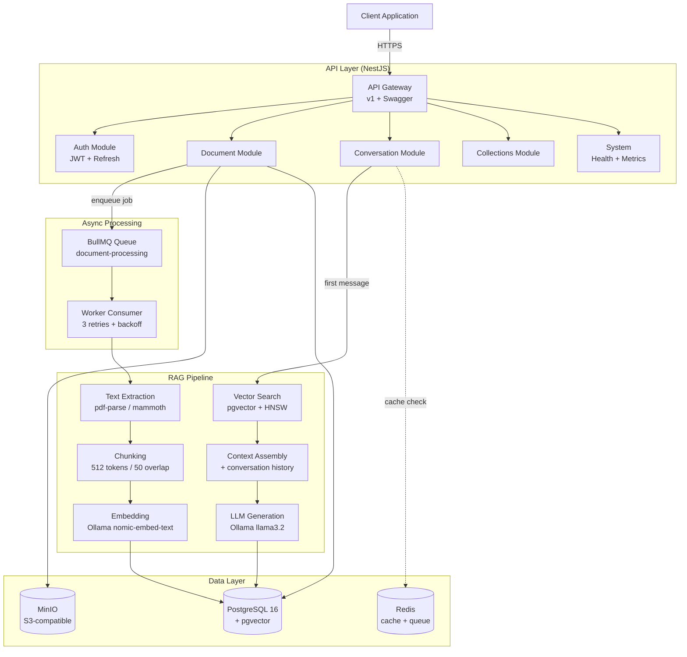
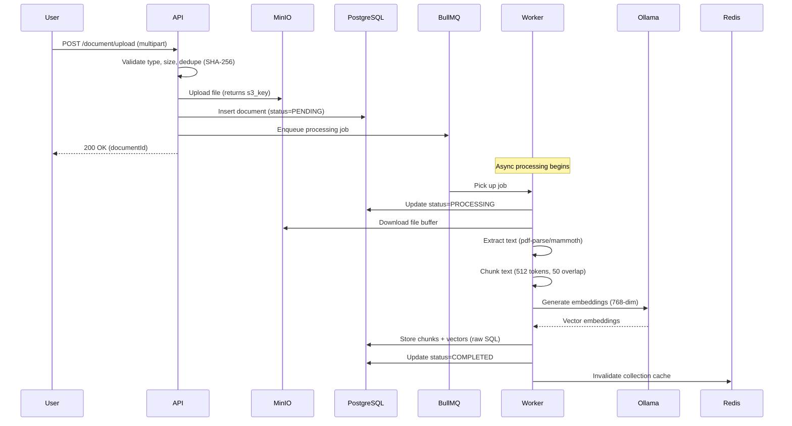
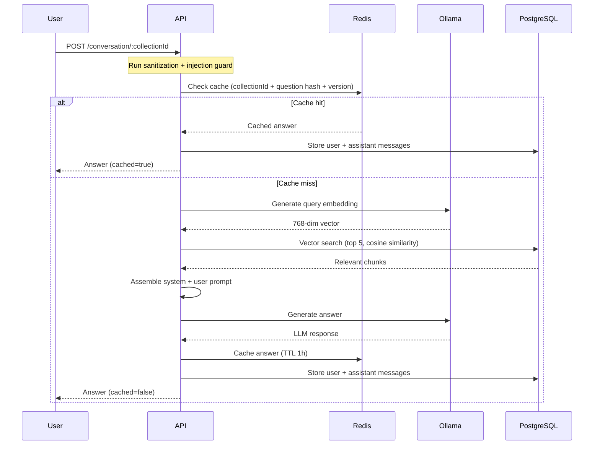
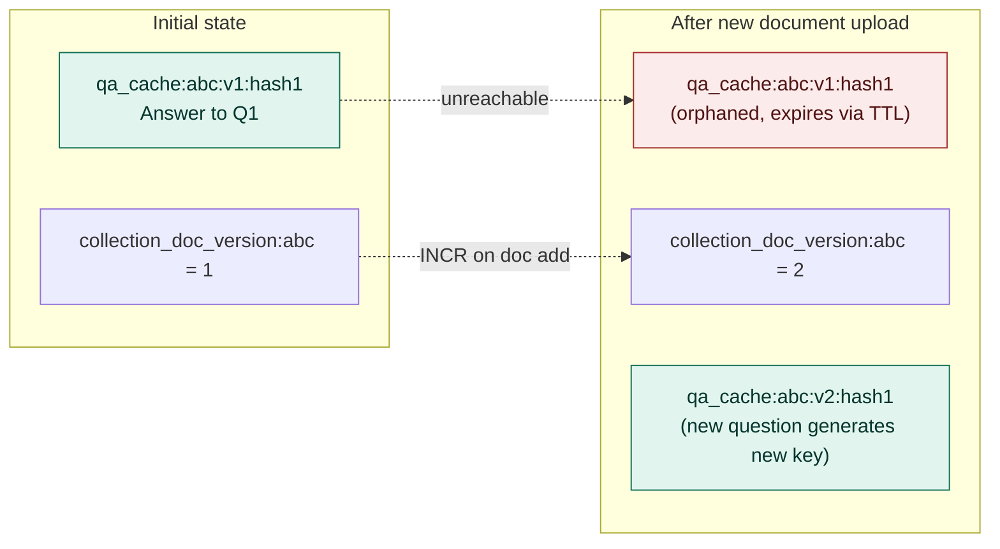
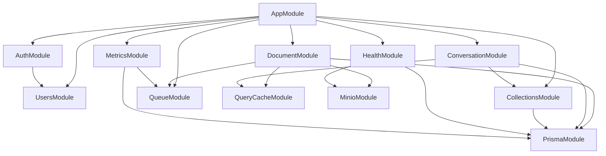
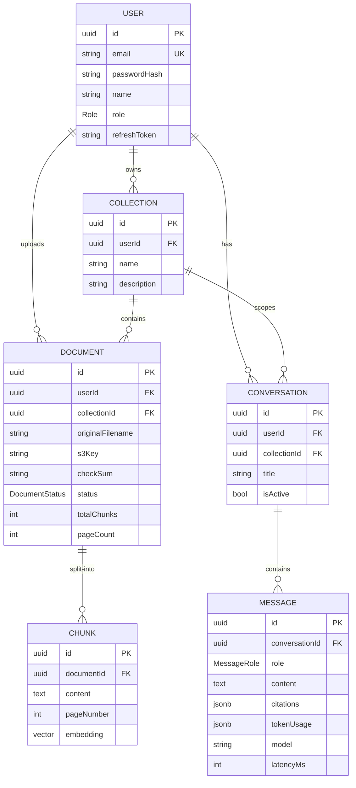

# Architecture

This document explains how DocuMind AI is structured at runtime, what data flows through each component, and why specific design decisions were made.

## High-level architecture

## Document ingestion flow

When a user uploads a document, the API responds immediately and processing happens asynchronously:

## RAG query flow

When a user asks a question, the system either serves from cache or runs the full pipeline:

## Cache invalidation strategy

The version-based invalidation pattern avoids expensive Redis SCAN operations:

## Module dependency graph

## Security layers

Every request passes through five layers before reaching business logic:

```mermaid
graph LR
    Req[Incoming Request]
    Helmet[Helmet<br/>Security headers]
    CORS[CORS<br/>Origin check]
    Throttle[CustomThrottlerGuard<br/>Tier-based limits]
    JWT[JwtAuthGuard<br/>Token validation]
    Sanitize[SanitizeInputInterceptor<br/>Strip HTML/null bytes]
    Injection[PromptInjectionGuard<br/>12 attack patterns]
    Validate[ValidationPipe<br/>DTO validation]
    Handler[Route Handler]

    Req --> Helmet --> CORS --> Throttle --> JWT --> Sanitize --> Injection --> Validate --> Handler

    style Req fill:#E6F1FB,stroke:#185FA5,color:#042C53
    style Handler fill:#E1F5EE,stroke:#0F6E56,color:#04342C
```

## Data model

